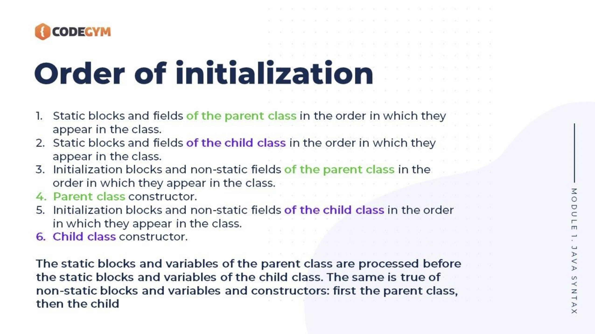

<h3>Subjects</h3>
Diverse subiecte/intrebari discutate la laborator.

<h5>SOLID Principles & Constant Interface </h5>

Aveti aici despre: [SOLID Principles](https://www.baeldung.com/solid-principles)
Si despre [Constant Interface](https://stackoverflow.com/questions/2659593/what-is-the-use-of-interface-constants)

<h5>Mostenire abstract/normal class</h5>

Am mai incercat niste chestii pe care le-am discutat la laborator cu unul din colegii vostrii, nu stiu cat de clar a fost pentru toata lumea, dar sunt cazurile urmatoare:

- Am o clasa de baza: BaseClass, o clasa Animal care extinde clasa BaseClass si dupa aceea clasa Cat, toate clase normale, atunci constructorii nu sunt necesari. 

Codul compileaza si fara sa adaugam constructorii. In cazul in care avem constructor in BaseClass, nu avem constructor in Animal si avem constructor in clasa Cat, atunci o sa se apeleze constructorul din BaseClass, chiar daca apelam sau nu constructorul din BaseClass in clasa Animal.
	
Totul se apeleaza normal, se apeleaza constructorul din Cat(), dupa aceea cel din Animal() si dupa aceea cel din BaseClass().
	

<u>Ideea din spate este ca in Java se apeleaza constructorul din clasa de baza implicit, inainte de a apela constructorul din clasa derivata.</u>

Astfel, daca in clasa de baza, BaseClass, avem constructori cu parametrii, iar noi nu avem un constructor care sa apeleze constructorul cu parametrii in clasa Animal, o sa primim o eroare de compilare deoarece compilatorul nu gaseste niciun constructor care sa mapeze pe constructorul din clasa BaseClass. (asta in cazul in care nu definim un constructor fara parametrii in BaseClass)
	
Din acelasi motiv, nu merge sa facem constructorul privat in clasa BaseClass, daca clasa Animal extinde clasa BaseClass, o sa tipe compilatorul la noi.

- Am o clasa de baza BaseClass, o clasa Animal care extinde clasa BaseClass, iar clasa Animal este o clasa abstracta, iar clasa Cat care extinde clasa Animal, clasa Cat fiind o clasa normala, <u>atunci totul se intampla exact la fel</u>.

Am pus pe github si codul la "incercarea" asta.
	
Gasiti [aici](https://www.baeldung.com/java-abstract-classes-constructors) si mai multe explicatii.

<h5>Order of initialization</h5>

<h5>'final' keyword on method parameters</h5>

V-am zis la primul laborator ca se poate adauga 'final' si la parametrii metodelor.

Cred ca merita aruncat un ochi peste [asta](https://stackoverflow.com/questions/2236599/final-keyword-in-method-parameters).